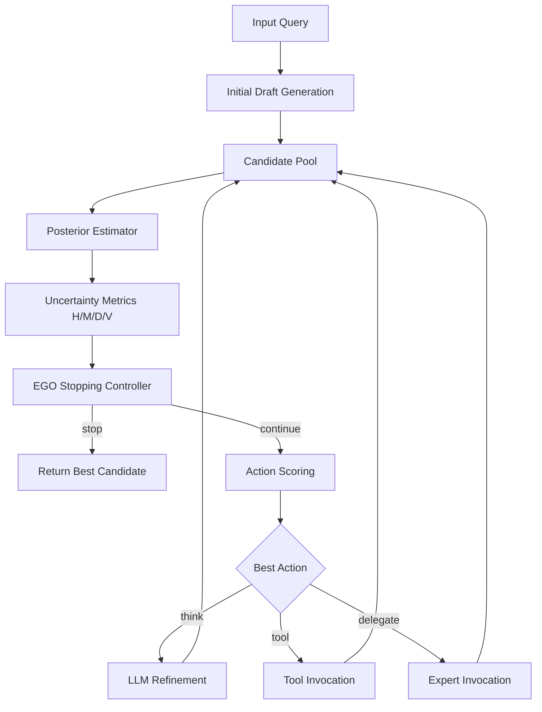

# Spec: EGO Budget-Aware Agent Orchestration Method

## 1. Overview

### 1.1 Feature name
EGO（Entropy-Gated Orchestration）预算感知智能体编排方法

### 1.2 Spec type
方法型研究规范文档（Method Spec）

### 1.3 Summary
本项目要实现一个面向 LLM Agent 的总控方法，使系统在有限预算下，能够在以下动作之间动态选择：

- `THINK`
- `TOOL(m)`
- `DELEGATE(k)`
- `STOP`

控制器不直接优化“单步回答质量”，而是优化：

> 在 token / latency / step 等预算约束下，何时继续、继续做什么、何时停止。

EGO 的核心思想是：

- 用候选答案集合构造近似 posterior；
- 用 entropy / margin / disagreement / verifier confidence 描述当前不确定性；
- 用 budget-aware threshold 决定是否停止；
- 用 value-of-information 或 learned scorer 决定选择哪个 continuation action。

---

## 2. Problem Statement

现有 agent 系统通常存在以下问题：

1. **停止机制弱**
   - 经常固定多步思考后再输出；
   - 或者没有 principled 的 stop rule。

2. **路由机制弱**
   - 工具调用、专家委托、内部推理常靠 prompt 习惯或硬编码；
   - 缺少统一动作空间和统一评分函数。

3. **预算意识弱**
   - 很多 agent 只追求效果，不显式建模 token / latency / step 成本；
   - 难以做 utility-aware 决策。

4. **缺少论文级 formalization**
   - 工程系统能跑，但难以形成 theorem、ablation、可解释分析。

本 spec 目标是把该问题定义为一个可研究、可实现、可实验验证的方法系统。

---

## 3. Goals

### 3.1 Primary goals
1. 定义一个统一的 agent orchestration 动作空间。
2. 定义一个基于不确定性与预算的 stop rule。
3. 定义一个统一的 action scoring / routing 机制。
4. 支持 heuristic routing 与 learned routing 两种版本。
5. 支持理论分析与受控实验验证。
6. 能以框架无关方式接入 LangChain-like agent stack。

### 3.2 Success criteria
如果以下条件成立，则认为方法 spec 达成：

1. **Formalization 完整**
   - 有状态、动作、预算、观测、目标函数定义。
2. **Stopping 机制可运行**
   - 能根据 uncertainty + budget 做 stop/continue 决策。
3. **Routing 机制可运行**
   - 能在 think/tool/delegate 中选择动作。
4. **Synthetic 实验可支持核心论点**
   - budget-aware stopping 至少不劣于强基线；
   - learned routing 在 mixed-task 环境中优于 heuristic routing 或在关键任务型上显著改善。
5. **可形成论文叙事**
   - 方法、理论、实验三部分可以对齐。

---

## 4. Non-goals

当前版本不以以下内容为主要目标：

1. 生产级 agent 平台。
2. 完整真实世界 benchmark 平台。
3. 多轮长期记忆系统。
4. 复杂工具链编排（长链计划、多阶段 workflow executor）。
5. 大规模离线训练系统。
6. 工业级 reward modeling / RL pipeline。

换言之，本项目当前是 **method prototype**，不是 production system。

---

## 5. Users / Stakeholders

### 5.1 Primary users
- 论文作者 / 研究者
- 需要分析 orchestration policy 的 agent 研究人员
- 想把 stop/routing 策略插入现有 agent stack 的原型开发者

### 5.2 Secondary users
- 需要研究 agent 工具调用与专家委托策略的人
- 需要 synthetic / controlled benchmark 做 routing sanity check 的实验人员

---

## 6. Core Concepts

### 6.1 Action space
系统每轮从以下动作中选择一个：

- `THINK`: 再进行一次内部推理 / refinement
- `TOOL(m)`: 调用工具 `m`
- `DELEGATE(k)`: 调用专家 `k`
- `STOP`: 停止并输出当前最优答案

### 6.2 State summary
控制状态由以下变量组成：

- `H_t`: predictive entropy
- `M_t`: answer margin
- `D_t`: disagreement
- `V_t`: verifier confidence
- `B_t^tok`: token budget
- `B_t^lat`: latency budget
- `B_t^step`: remaining step budget

v1 实现中，最核心的是：

- entropy
- disagreement
- verifier confidence
- step budget

### 6.3 Posterior approximation
系统维护候选答案池 `C_t`。候选来源包括：

- 初始 draft
- think 后新候选
- tool-augmented 候选
- delegated expert 候选

每个候选由 verifier / support / recency 等信息打分，并通过 softmax 形成近似 posterior。

### 6.4 Utility objective
方法要优化的是：

- 最终答案质量 / verifier reward
- 减去 token / latency / step / risk 成本

这意味着 EGO 不是单纯追求“多调用工具”或“多思考”，而是追求 **net utility**。

---

## 7. Functional Requirements

### FR-1: Controller must support explicit stop/continue decisions
系统必须在每轮根据当前 uncertainty summary 和剩余预算作出 stop/continue 决策。

#### Acceptance criteria
- 支持 budget-aware entropy threshold。
- 支持 continuation score 判断。
- 当预算耗尽时必须 stop。

### FR-2: Controller must score continuation actions in a unified action space
系统必须对 think、tool、delegate 动作做统一评分，并选取得分最高动作。

#### Acceptance criteria
- 动作输出包含 `chosen_action`。
- 每轮都可以记录候选动作及其 score。
- 支持多工具、多专家。

### FR-3: System must estimate uncertainty from candidate answers
系统必须从 candidate pool 中估计不确定性，而不是硬编码一个固定 confidence。

#### Acceptance criteria
- 能从候选答案估计 entropy。
- 能估计 margin 与 disagreement。
- 能估计 verifier confidence。

### FR-4: System must support tool and expert relevance priors
系统必须允许 tool/expert relevance 进入 action scoring。

#### Acceptance criteria
- 支持 tool relevance function。
- 支持 expert relevance function。
- 支持 prior relevance 配置项。

### FR-5: System must support learned action scoring
系统必须支持 learned scorer 作为 routing 层的可选实现。

#### Acceptance criteria
- 支持基于特征向量的 action scorer。
- 支持 per-action online update。
- 支持 heuristic + learned hybrid scoring。

### FR-6: System must expose trajectory for evaluation
系统必须输出可分析的轨迹，供 benchmark / ablation 使用。

#### Acceptance criteria
- 每步记录 metrics。
- 每步记录 decision。
- 每步记录 action_scores。
- 每步记录 chosen_action。
- 最终输出 final_answer。

---

## 8. Algorithm Requirements

### 8.1 Stopping rule
EGO 必须包含两层停止逻辑：

1. **Threshold gate**
   - 当 entropy 足够低，且其他 uncertainty signal 也不支持继续时，可直接停止。

2. **Value-based stop**
   - 当所有 continuation actions 的净收益都不为正时，停止。

### 8.2 Action scoring
每个非停止动作必须具有统一评分：

- heuristic v1:
  - `score(a) = estimated_gain(a) - cost(a)`

- learned / hybrid v1:
  - `score(a) = predicted_reward(a) + exploration_bonus(a) + λ * heuristic_gain(a) - cost(a)`

### 8.3 Feature requirements for learned scorer
learned scorer 的特征至少应覆盖：

- entropy
- margin
- disagreement
- verifier confidence
- steps remaining
- action cost
- action relevance
- action prior relevance
- action type indicators

---

## 9. Architecture



### 9.1 Core modules

#### Module A: `ego_core`
职责：
- 预算对象定义
- uncertainty metrics 结构定义
- stopping controller
- posterior estimation

#### Module B: `langchain_ego_adapter`
职责：
- 兼容 invoke 风格的 LLM / tool / expert
- 编排 think/tool/delegate 执行流程
- 输出轨迹与最终结果

#### Module C: `learned_action_scorer`
职责：
- 特征构建
- contextual bandit / LinUCB 风格 action scoring
- online update

#### Module D: `envs + solvers + policies`
职责：
- synthetic environment
- oracle solver
- baseline policies
- theorem-aligned validation

#### Module E: `scripts`
职责：
- demo 运行
- synthetic theorem validation
- routing benchmark

---

## 10. Evaluation Requirements

### 10.1 Stopping evaluation
必须至少支持以下 stopping 对比：

- oracle threshold
- budget-aware threshold
- fixed threshold
- fixed depth
- immediate stop
- never stop early

#### Metrics
- avg reward
- stop time
- final entropy
- budget utilization

### 10.2 Routing evaluation
必须至少支持以下 routing 对比：

- heuristic routing
- learned routing
- 后续可扩展 oracle routing / tuned heuristic

#### Metrics
- final reward
- first-action accuracy
- reward_by_type
- first_action_accuracy_by_type

### 10.3 Task families for controlled benchmark
当前受控 benchmark 至少覆盖：

- math
- calc
- search
- code
- think

目标是显式区分：

- tool routing 的价值
- delegate routing 的价值
- internal reasoning 的价值

---

## 11. Theoretical Alignment Requirements

该 spec 对论文理论部分的要求是：

### TR-1: Theorem A alignment
系统应支持一个 budget-dependent stopping threshold 的理论叙事：

- 当剩余 budget 更多时，controller 应更愿意继续；
- 停止阈值应随 budget 增加而降低。

### TR-2: Theorem B alignment
系统应支持 uncertainty estimation error 下的性能鲁棒性分析：

- posterior / verifier 误差会影响 stopping quality；
- 但性能损失应可被上界化或至少可实验支持。

### TR-3: Routing extension alignment
系统应支持后续加入 routing regret / suboptimality 分析：

- learned scorer 采用 bandit-friendly 结构；
- 动作特征与 per-action update 可支持此叙事。

---

## 12. Data / Benchmark Requirements

### 12.1 Current benchmark constraints
当前 benchmark 可以是 mock / controlled benchmark，但必须满足：

1. 不同 task type 对不同动作有明确偏好。
2. verifier 应能区分“有帮助”和“最优帮助”的动作结果。
3. benchmark 输出应能支持 routing 学习是否有效的分析。

### 12.2 Future benchmark upgrades
后续版本建议支持：

- train/eval split
- oracle routing baseline
- tuned heuristic baseline
- cumulative adaptation curve
- cost-aware utility
- 更真实的 tool / trace / QA 数据

---

## 13. Deliverables

### 13.1 Required deliverables
1. 方法 formalization 文档
2. 算法说明文档
3. theorem scaffold 文档
4. synthetic stopping 实验脚本
5. LangChain-compatible adapter
6. learned routing prototype
7. mixed-task routing benchmark
8. 项目 README / spec 文档

### 13.2 Nice-to-have deliverables
1. 论文 method section 初稿
2. 论文 experiment section 初稿
3. adaptation curve 图表
4. oracle routing baseline
5. cost-aware utility 分析

---

## 14. Out of Scope for v1

以下内容明确不纳入 v1：

- 多 agent 协作通信协议设计
- 复杂 DAG workflow planner
- 真正的 production observability / tracing platform
- 真实线上流量评估
- 完整 reinforcement learning 训练闭环
- 大规模 benchmark leaderboard

---

## 15. Risks

### Risk-1: Benchmark 过于 toy
风险：实验支持力度不足，论文说服力弱。

缓解：
- 把 benchmark 定位为 controlled routing benchmark；
- 增加更真实的 held-out evaluation。

### Risk-2: Heuristic 与 learned 差距不明显
风险：方法贡献点不够突出。

缓解：
- sharpen task-action separation；
- 引入 oracle / tuned baselines；
- 增加 adaptation curve。

### Risk-3: 理论与实现脱节
风险：paper narrative 不连贯。

缓解：
- 保持 theorem A/B 与 stop/routing 模块一一对应；
- 每个 theorem 都配一个 theory-aligned synthetic setting。

---

## 16. Milestones

### M1: Formal core frozen
- 完成状态、动作、预算、目标函数定义
- 完成 EGO-v1 算法冻结

### M2: Stopping prototype validated
- 完成 synthetic entropy env
- 完成 oracle threshold 对比
- 完成 stopping baseline 对比

### M3: Routing prototype validated
- 完成 think/tool/delegate 统一动作空间
- 完成 heuristic routing
- 完成 learned scorer 接入
- 完成 mixed-task benchmark

### M4: Paper-ready upgrade
- 完成更强 baseline
- 完成更强评估协议
- 完成方法与理论部分初稿

---

## 17. Current Implementation Mapping

当前项目中文件与 spec 的映射关系如下：

- `docs/01_formalization.md`
  - 对应 formal problem definition
- `docs/03_algorithm_v1.md`
  - 对应 EGO-v1 algorithm spec
- `docs/06_theorem_A_refined.md`
  - 对应 stopping threshold theory
- `docs/08_theorem_B_draft.md`
  - 对应 uncertainty estimation robustness
- `src/integrations/ego_core.py`
  - 对应 stopping controller + posterior estimator
- `src/integrations/langchain_ego_adapter.py`
  - 对应 orchestration adapter
- `src/integrations/learned_action_scorer.py`
  - 对应 learned routing layer
- `scripts/run_synthetic_theorem_a.py`
  - 对应 stopping validation
- `scripts/mixed_task_routing_benchmark.py`
  - 对应 routing validation

---

## 18. Final Positioning

本项目的定位应明确为：

> 一个面向 AAAI 方法论文的、预算感知的 agent orchestration 方法原型。

它的主贡献不应表述为“做了一个 benchmark”，而应表述为：

1. 提出 EGO 方法；
2. 给出 stop/routing 的统一控制框架；
3. 提供理论与实验上的初步支撑；
4. 通过 controlled benchmark 与 adapter demo 验证方法有效性。


---

## 19. Benchmark Construction Specification

本节补充说明：EGO 的 benchmark 不应只理解为“找一个现成数据集跑一下”，而应被构造成一个**同时服务于 stopping、routing、utility** 的多层评测体系。

### 19.1 Benchmark objectives
EGO benchmark 需要同时回答以下问题：

1. **Stopping 是否合理**
   - 系统是否能在预算有限时及时停止；
   - 是否优于 fixed-depth / fixed-threshold 这类简单策略。

2. **Routing 是否合理**
   - 系统是否能在 `think / tool / delegate` 之间选对动作；
   - learned routing 是否优于 heuristic routing。

3. **Cost-aware utility 是否改善**
   - 最终效果是否值得额外的 step / token / latency 成本；
   - orchestration gain 是否不是“靠盲目多做几步”换来的。

---

### 19.2 Benchmark layers
完整论文实验中的 benchmark 应分成至少两层，理想情况下三层：

#### Layer A: Controlled stopping benchmark
用途：
- 用于验证 Theorem A 对应的 stopping story；
- 主要测 budget-aware threshold 是否优于固定策略。

当前项目中对应：
- `scripts/run_synthetic_theorem_a.py`

#### Layer B: Controlled routing benchmark
用途：
- 用于验证 task-action specialization 是否可学习；
- 主要测 heuristic routing 与 learned routing 的差异。

当前项目中对应：
- `scripts/mixed_task_routing_benchmark.py`

#### Layer C: Realistic mixed-task benchmark
用途：
- 用于在真实 query / 真实模型 / 更真实 evaluator 下验证 EGO；
- 是后续完整论文实验最关键的一层。

当前项目中已开始构建：
- `data/realistic_mixed_task_benchmark_v1.json`

---

### 19.3 Why benchmark needs standard answers
对于 EGO 这类 orchestration 方法，benchmark 不能只包含 query，而必须至少包含两类 ground truth：

#### (1) Final-answer ground truth
用于评估最终答案质量。其形式因任务类型而异：

- `calc`：唯一数值答案
- `search`：reference answer + reference evidence
- `code`：reference points / key implementation points
- `math` / `think`：rubric / key reasoning points

#### (2) Action-selection ground truth
用于评估 routing 是否正确，即：

- 该 query 的 `best_action` 是什么？
- 第一跳是否选对？

因此，EGO benchmark 是一个**双重标注 benchmark**：

- 既评最终答案；
- 也评动作选择。

---

### 19.4 Benchmark item schema
每条 benchmark 数据应满足统一 schema。推荐字段如下：

```json
{
  "id": "search_001",
  "query": "Which file defines the LinUCB-based learned action scorer?",
  "task_type": "search",
  "best_action": "tool:search",
  "reference_answer": "src/integrations/learned_action_scorer.py",
  "reference_points": ["class LinUCBActionScorer"],
  "rubric": null,
  "evaluation_type": "substring_or_evidence_match",
  "metadata": {
    "source": "project_corpus_ai_assisted",
    "difficulty": "easy"
  }
}
```

#### Required fields
- `id`
- `query`
- `task_type`
- `best_action`
- `evaluation_type`

#### At least one answer reference field is required
至少要有以下字段之一：
- `reference_answer`
- `reference_points`
- `rubric`

---

### 19.5 Supported task families
当前 benchmark v1 按动作价值构造为五类任务：

1. `math`
   - 倾向于 `delegate:math`
   - 以 theorem intuition、proof explanation、formal reasoning 为主

2. `calc`
   - 倾向于 `tool:calculator`
   - 以数值计算、公式代入、得分函数计算为主

3. `search`
   - 倾向于 `tool:search`
   - 以项目文件定位、文档证据查找、定义发现为主

4. `code`
   - 倾向于 `delegate:code`
   - 以模块定位、应修改的文件、关键函数和类为主

5. `think`
   - 倾向于 `think`
   - 以高层解释、概念区分、项目定位总结为主

这种 task-family 设计的核心目的，是让 benchmark 能显式测出：
- tool routing 的价值；
- delegate routing 的价值；
- internal reasoning 的价值。

---

### 19.6 Evaluation types
benchmark v1 当前支持以下评测类型：

#### `numeric_exact`
适用于：
- 数值计算题

要求：
- 有 `reference_answer`
- 可带 `numeric_tolerance`

#### `substring_or_evidence_match`
适用于：
- search / file-locating 类任务

要求：
- answer 中应包含 reference answer 或关键 evidence

#### `reference_points_judge`
适用于：
- code 类开放题

要求：
- 回答应覆盖若干关键文件、类、方法或修改点

#### `rubric_judge`
适用于：
- math / think 类开放题

要求：
- 回答应满足 rubric 中列出的关键论点和约束

---

### 19.7 Current realistic benchmark dataset (v1)
当前项目已新增第一版 realistic benchmark 数据：

- `data/realistic_mixed_task_benchmark_v1.json`

#### Dataset size
- 总计：30 条
- 每类任务：6 条

#### Distribution
- `math`: 6
- `calc`: 6
- `search`: 6
- `code`: 6
- `think`: 6

#### Annotation status
该数据集当前应准确表述为：

> **AI-assisted benchmark construction v1**

这意味着：
- query、best_action、reference_answer / reference_points / rubric 由 AI 生成初稿；
- 可直接用于第一轮实验开发；
- 论文中应诚实标注为 AI-assisted annotation，而非 fully human gold benchmark。

#### Recommended validation process
对于该 v1 数据，建议按以下方式升级：

1. **AI draft annotation**
   - 当前已完成
2. **light human review**
   - 每类任务抽样检查 `best_action` 和 reference quality
3. **oracle / rollout validation for best_action**
   - 对关键样本比较不同首动作的最终 utility
4. **v2 benchmark release**
   - 形成更稳健的论文实验数据

---

### 19.8 Current benchmark limitations
当前 benchmark 体系仍存在以下限制：

1. realistic dataset 规模仍小（30 条）
2. `best_action` 目前主要来自 AI-assisted labeling，而非 oracle rollout
3. open-ended 题目较多，judge 仍可能存在波动
4. 当前还没有统一 evaluator 将所有 `evaluation_type` 全部跑通
5. 仍未形成 train / eval split、多 seed、统计显著性评估

因此，当前 benchmark 的定位应是：

> 从 mock scaffold 向 paper-grade benchmark 过渡的第一版实验数据基础。

---

### 19.9 Required benchmark metrics
针对完整 benchmark，至少需要以下指标：

#### Final-answer metrics
- answer quality / reward
- utility under cost
- reward by task type

#### Routing metrics
- first-action accuracy
- first-action accuracy by task type
- action confusion matrix
- adaptation curve（后续）

#### Cost metrics
- total steps
- tool usage count
- delegate usage count
- estimated token cost
- latency proxy

#### Stopping metrics
- stop depth
- stop reason distribution
- final entropy（适用于 synthetic stopping block）

---

### 19.10 Benchmark positioning in the paper
论文中应明确区分以下三种 benchmark 角色：

1. **synthetic stopping benchmark**
   - 支撑 stopping theorem / threshold story

2. **controlled routing benchmark**
   - 支撑 routing specialization / learned-vs-heuristic story

3. **realistic mixed-task benchmark**
   - 支撑真实实验中的方法有效性

其中：
- Layer A 和 Layer B 用于方法分析；
- Layer C 用于增强论文的外部说服力。

因此，benchmark 在本文中的定位不是“独立研究对象”，而是：

> 用于验证 EGO 方法在 stopping、routing、utility 三个维度上的有效性。


### 19.11 Benchmark dataset update (v2)
realistic benchmark 现已扩展为第二版数据集：

- `data/realistic_mixed_task_benchmark_v2.json`

#### Dataset size
- 总计：100 条
- 每类任务：20 条

#### Distribution
- `math`: 20
- `calc`: 20
- `search`: 20
- `code`: 20
- `think`: 20

#### Split metadata
v2 数据集在 `metadata.split` 中预留了：
- `train`
- `dev`
- `test`

其目的是为后续 learned routing 的 held-out evaluation 做准备。当前 split 仍属于 benchmark scaffold 阶段，后续可以根据正式实验协议调整。

#### Positioning
因此，当前 realistic benchmark 的最新定位应为：

> **AI-assisted realistic mixed-task benchmark v2 (100 items)**

它较 v1 更适合作为：
- evaluator 开发基础；
- baseline matrix 对接基础；
- 真实模型 routing 实验的第一版数据底座。


### 19.12 Benchmark dataset update (v3)
realistic benchmark 已继续扩展为第三版数据集：

- `data/realistic_mixed_task_benchmark_v3.json`

#### Dataset size
- 总计：300 条
- 每类任务：60 条

#### Distribution by task family
- `math`: 60
- `calc`: 60
- `search`: 60
- `code`: 60
- `think`: 60

#### Difficulty handling
v3 数据集显式引入了难度分层字段：

- `metadata.difficulty`: `easy | medium | hard`
- `metadata.difficulty_cn`: `简单 | 中等 | 复杂`
- `metadata.expected_reasoning_steps`: 预期推理层级（1/2/3）

推荐解释如下：

- `easy`
  - 单跳定位、单步计算、直接概念解释
- `medium`
  - 需要结合 method + benchmark / implementation 的双层理解
  - 或包含多项公式组合、模块-指标联动理解
- `hard`
  - 需要更强的研究性解释、多条件推理、限制条件分析
  - 或者需要把 benchmark、theory、routing、cost 等多个维度一起纳入回答

#### Split handling
v3 继续保留 split 元数据：

- `train`: 36 / task family
- `dev`: 12 / task family
- `test`: 12 / task family

即每类任务 60 条，按 `36/12/12` 拆分，为后续 learned routing 的正式 train/dev/test 协议提供接口。

#### Positioning
当前最准确的定位应为：

> **AI-assisted realistic mixed-task benchmark v3 (300 items, difficulty-aware)**

它相对 v2 的改进点在于：
- 样本规模更大；
- 每类任务内有显式难度分层；
- 更适合做 per-difficulty、per-task-family 的 routing / utility 分析；
- 更适合作为后续 baseline matrix 和 evaluator 对接的数据底座。


---

## 20. Benchmark Evaluator Specification

为了让 benchmark 从“静态数据文件”升级为“可执行评测协议”，项目需要一个统一 evaluator 来解释每条 benchmark item 的 `evaluation_type` 并输出可比较分数。

### 20.1 Evaluator responsibilities
benchmark evaluator 必须负责：

1. 读取 benchmark item 的 answer-side supervision：
   - `reference_answer`
   - `reference_points`
   - `rubric`
   - `evaluation_type`

2. 将不同 task family 的 supervision 映射成统一 reward 标度。

3. 输出 item-level score，作为：
   - final-answer reward
   - reward_by_type / difficulty / split 的基础

4. 支持 mock/offline 与 real/LLM-judge 两种运行方式。

---

### 20.2 Supported evaluation types in code
当前 evaluator 已实现于：

- `src/integrations/benchmark_evaluator.py`

已支持四类评测：

#### A. `numeric_exact`
适用于：
- `calc`

行为：
- 从答案中提取数值；
- 与 `reference_answer` 比较；
- 按 tolerance 或相对误差映射到 reward。

#### B. `substring_or_evidence_match`
适用于：
- `search`

行为：
- 检查答案是否包含 `reference_answer`；
- 或是否覆盖 `reference_points` 中的 evidence；
- 依据命中程度给分。

#### C. `reference_points_judge`
适用于：
- `code`

行为：
- 检查答案是否覆盖关键文件、类、方法、配置点；
- 在 mock 模式下使用启发式 key-point 匹配；
- 在 real 模式下可切换为 LLM judge。

#### D. `rubric_judge`
适用于：
- `math`
- `think`

行为：
- 检查答案是否满足 rubric 和 reference points；
- 在 mock 模式下使用启发式匹配；
- 在 real 模式下可调用 LLM-as-judge。

---

### 20.3 Mock-mode vs real-mode evaluation
当前 evaluator 的运行分为两类：

#### Mock / offline mode
- 不依赖外部 judge API；
- 对开放题采用 key-point / rubric 启发式匹配；
- 适合本地开发与 baseline scaffold 调试。

#### Real mode
- 可通过 OpenAI-compatible model 充当 judge；
- 适合在真实模型上进行更强的 benchmark scoring；
- 但成本和耗时显著高于 mock mode。

因此，当前 benchmark evaluator 应理解为：

> 一个支持“离线启发式评测 + 在线 LLM-judge 评测”的双模式 evaluator。

---

## 21. Baseline Matrix Specification

论文实验不能只跑单一 agent。为了证明 EGO 的价值，benchmark 必须支持 baseline matrix。

### 21.1 Baseline matrix objective
baseline matrix 用于同时回答：

1. **自己的优化前后对比**
   - heuristic EGO vs learned EGO

2. **与简单固定 workflow 的对比**
   - always think
   - tool first
   - delegate first

3. **是否真的学到了 routing specialization**
   - first-action accuracy
   - reward by task family
   - reward by difficulty

---

### 21.2 Current baseline families
当前已落地的 baseline matrix 脚本位于：

- `scripts/run_baseline_matrix.py`

当前支持以下 baseline：

#### 1. `always_think`
- 固定使用 `think`，直到步数预算耗尽。

#### 2. `tool_first`
- 先选最相关 tool；
- 后续剩余步骤走内部 refinement。

#### 3. `delegate_first`
- 先选最相关 expert；
- 后续剩余步骤走内部 refinement。

#### 4. `heuristic_ego`
- EGO controller
- 不启用 learned scorer

#### 5. `learned_ego`
- EGO controller
- 启用 learned scorer

这些 baseline 的意义是：

- `always_think`：代表纯内部推理 agent
- `tool_first`：代表固定 tool workflow
- `delegate_first`：代表固定 delegate workflow
- `heuristic_ego`：代表未优化/弱优化版本
- `learned_ego`：代表当前 full EGO 路由版本

---

### 21.3 Why baseline matrix is necessary
如果没有 baseline matrix，则无法回答以下关键论文问题：

- EGO 的增益是否只是因为任务太简单？
- learned routing 是否真的优于 heuristic routing？
- EGO 是否优于固定 workflow agent？
- orchestration 改进究竟来自 stopping、routing、还是单纯多做几步？

因此，baseline matrix 不是附加项，而是：

> EGO 论文实验成立的必要条件之一。

---

## 22. Logging and Run Observability Specification

随着 benchmark 规模扩大到 v3（300 items）并接入真实模型，运行日志成为必要基础设施。

### 22.1 Logging objectives
日志系统必须能帮助定位：

1. 哪一题最慢；
2. 哪种 task family 最慢；
3. 是 agent 调用慢还是 judge 调用慢；
4. controller 是否过早 stop；
5. baseline matrix 在哪一个 baseline 上耗时最大。

### 22.2 Current logging support
当前 runner 已支持：

- `scripts/run_configurable_routing_experiment.py`
- `scripts/run_baseline_matrix.py`

通过 `--log-file` 可输出结构化日志。

### 22.3 Current logged fields
日志当前会记录：

- `task=i/N`
- benchmark item id
- task type
- difficulty
- split
- evaluation type
- first action
- reward
- stop reason
- item-level elapsed time
- run-level total elapsed time

这使得 real benchmark 运行从“黑箱等待”升级为：

> 可定位瓶颈、可解释耗时、可诊断控制行为的实验过程。

---

## 23. Current Experiment Infrastructure Status

截至当前版本，项目的实验基础设施已经分为以下层次：

### 23.1 Data layer
- `data/realistic_mixed_task_benchmark_v1.json`
- `data/realistic_mixed_task_benchmark_v2.json`
- `data/realistic_mixed_task_benchmark_v3.json`

### 23.2 Evaluator layer
- `src/integrations/benchmark_evaluator.py`

### 23.3 Runner layer
- `scripts/run_configurable_routing_experiment.py`
- `scripts/run_baseline_matrix.py`

### 23.4 Runtime layer
- `src/integrations/experiment_runtime.py`

### 23.5 Config layer
- `configs/experiment_benchmark_v3_mock.json`
- `configs/experiment_benchmark_v3_real.json`
- `configs/baseline_matrix_v3_mock.json`
- `configs/baseline_matrix_v3_deepseek_smoke5.json`

---

## 24. DeepSeek-Compatible Real Experiment Path

当前项目已验证可以通过 OpenAI-compatible 接口连接 DeepSeek API。

### 24.1 Current compatibility setting
已验证的兼容配置为：

- base URL: `https://api.deepseek.com`
- model: `deepseek-v4-flash`

### 24.2 Current usage positioning
DeepSeek 当前在本项目中的定位应为：

- 用于 real-mode smoke test
- 用于验证 benchmark evaluator 与真实模型是否打通
- 用于 small-scale baseline comparison smoke runs

而不是：

- 直接承担完整 300-item 论文主实验的首轮跑法

### 24.3 Why smoke tests are necessary
在真实模型接入后，项目已观察到：

- `calc` 类题较快；
- `math` / `code` / `search` / `think` 等开放题和检索题明显更慢；
- LLM judge 会显著增加延迟；
- 某些题上 controller 可能出现 `first_action=None` 的过早停止行为。

因此，当前推荐路径是：

1. 先跑 single-item / smoke5；
2. 再跑 small baseline matrix；
3. 最后才扩到更大规模 benchmark slice。

---

## 25. Current limitations of the experiment system

尽管 benchmark 和 baseline 基础设施已经成型，但当前仍应诚实记录以下限制：

1. **real benchmark 仍以 smoke test 为主**
   - 尚未完成 300-item 全量真实模型跑分。

2. **open-ended tasks are slow**
   - LLM judge 对 `math` / `code` / `think` 明显增加时延。

3. **controller calibration is not final**
   - 当前 real mode 上出现过 `first_action=None` 的保守 stop 行为。

4. **benchmark labels are AI-assisted**
   - v3 仍未升级到 fully human-gold 或 oracle-validated final release。

5. **baseline family is still growing**
   - 当前 baseline 以五个主 baseline 为主，尚未加入更丰富的 workflow baselines。

因此，当前实验系统最准确的定位应为：

> 已具备论文级实验框架雏形，但真实大规模实验尚处于 smoke-to-scaled transition 阶段。

---

## 26. What the paper can honestly claim at this stage

在当前版本下，论文或项目汇报中可以诚实表达的说法应是：

1. 已完成 EGO 方法 formalization、theory scaffold、benchmark schema、evaluator scaffold、baseline matrix scaffold。
2. 已构建 300-item、difficulty-aware、AI-assisted realistic mixed-task benchmark v3。
3. 已完成 mock-mode 与 DeepSeek-compatible real-mode 的初步 smoke-test 路线打通。
4. 已开始在统一 benchmark 上比较固定 workflow baselines、heuristic EGO 与 learned EGO。

而不应过度表达为：

- 已完成完整论文主实验；
- 已完成大规模真实 benchmark 统计；
- 已完成 human-gold benchmark release。

这类表述边界对于论文可信度非常重要。

---

## 27. Current progress snapshot (2026-06-18)

本节补充记录当前仓库里与 learned action scorer / finetuning data 直接相关的最新进度，用于避免 spec 与工作区状态脱节。

### 27.1 Learned action scorer status

当前已完成：

- `src/integrations/learned_action_scorer.py` 已实现 `EGOFeatureBuilder` 与 `LinUCBActionScorer`；
- learned scorer 已能使用 entropy、margin、disagreement、verifier confidence、steps remaining、action cost、relevance、prior relevance、action type 等特征；
- scorer 已支持 per-action online update；
- LangChain-compatible EGO adapter 已支持 heuristic + learned hybrid scoring；
- mixed-task benchmark、baseline matrix、configurable runner 已可用于 heuristic-vs-learned 路由实验。

因此，**传统线性/bandit 版本的动作打分器原型已经完整落地**。当前研究重点已转向基于大模型监督微调（SFT）的神经动作选择器。

### 27.2 Finetuning infrastructure status

当前已完成：

- `training/README_router_finetune.md`：给出了 router SFT 启动方式；
- `training/llamafactory_data/dataset_info.json`：已注册若干 router 数据集条目；
- `training/llamafactory_configs/qwen25_router_lora_sft.yaml`：已有 LoRA SFT 配置；
- `scripts/export_router_sft_data.py`、`scripts/convert_*_to_router_sft.py`、`scripts/train_router_with_llamafactory.sh`：已形成导出、转换、训练完整脚手架；
- 已验证 Llamafactory 训练流程可跑通。

这意味着：**从原始 manual 样本到微调 checkpoint 的完整链路已经具备可执行基础设施**，仅缺少已冻结的真实训练数据集接入。

### 27.3 Current training-data reality

按当前仓库状态，应明确区分以下几类数据：

1. **Synthetic / warm-start SFT data**
   - `training/llamafactory_data/router_sft_seed.jsonl`
   - `training/llamafactory_data/router_sft_tau2_airline_raw.jsonl`
   - `training/llamafactory_data/router_sft_tau2_airline_raw_v2.jsonl`
   - `training/llamafactory_data/router_sft_bfcl_raw.jsonl`
   - `training/llamafactory_data/router_sft_mixed.jsonl`

   这些文件已经存在，可用于训练 warm-start scorer / router，但它们**不应被表述为本文主要结论所依赖的真实 state-level 主训练集**。

2. **Manual tau2 state-level samples (1000 completed)**
   - `outputs/tau2_manual_sample_001.json` 至 `outputs/tau2_manual_sample_1000.json`

   当前仓库已经完整拥有 1000 条手动标注的 tau2 state-level 样本，最新全量硬审计结果位于：
   - `outputs/tau2_manual_audit_report_1000.json`

   审计报告确认：
   - `expected_files = 1000`，`present_files = 1000`，`missing_count = 0`
   - `schema_issue_count = 0`，`argmax_issue_count = 0`，`metric_issue_count = 0`
   - 完整覆盖三个领域：`airline(513) / retail(238) / telecom(249)`

   所有 1000 条样本均已完成：
   - 多轮逐条语义复核与返修
   - 全量 schema 验证
   - argmax 一致性校验
   - 领域混合均衡

   剩余待处理：
   - ~50 个 telecom 样本的 `sample_id`/`task_id` 仍带有 scenario/persona 描述性文本，需要规范化为简洁格式；
   - 不到 10 个边界样本存在 action-space 语义张力，需要最后一轮人工确认。

   因此，当前最准确的表述是：**1000 条样本已全部通过硬审计和语义复核，仅残留极少量尾部规范化工作，已接近可训练资产冻结状态**。

### 27.4 Current finetuning-path status

截至当前版本，最准确的表述应为：

> learned action scorer（包括 LinUCB 和 SFT 两种路径）的算法与工程都已实现；finetuning 基础设施已完全打通；manual tau2 样本已经扩展到 1000 条并完成全量硬审计和多轮复核；但"accepted subset 冻结 → router SFT 转换 → dataset 注册 → split 协议冻结 → 正式训练与评测"这端到端闭环仍未完全完成。

当前默认训练配置仍使用：

- `training/llamafactory_configs/qwen25_router_lora_sft.yaml`
- `dataset: ego_router_seed`

因此，**默认训练入口仍偏向 synthetic warm-start，尚未切换到 1000 条 manual tau2 样本主导的数据路线**。

---

## 28. Current TODO for learned scorer and finetuning data

### 28.1 Data acceptance and audit (当前最高优先级)

当前 1000 条样本已完成全量 hard audit 和多轮逐条语义复核，剩余收口工作：

- 规范化 ~50 个 telecom 样本的 `sample_id`/`task_id`，移除 scenario/persona 描述性文本；
- 对不到 10 个边界样本做最后一轮人工确认，解决 action-space 语义张力问题；
- 最终冻结 accept 样本列表，形成干净的 `accepted_1000` subset。

### 28.2 Dataset conversion and registration

完成验收后，下一步将 manual tau2 样本转换为正式可训练数据集：

- 编写 `convert_tau2_manual_to_router_sft.py` 转换脚本；
- 生成 `training/llamafactory_data/router_sft_tau2_manual_1000.jsonl`；
- 在 `training/llamafactory_data/dataset_info.json` 注册新数据集；
- 创建专用训练配置 `training/llamafactory_configs/qwen25_router_lora_sft_tau2_manual.yaml`。

### 28.3 Split and mixing protocol

在正式训练前冻结数据协议：

- 当前方案：`accepted_1000` 按 80%/10%/10% 切分为 `train(800) / dev(100) / test(100)`；
- 不混合 synthetic warm-start 数据，直接用纯 manual tau2 数据训练；
- 主要结论基于纯 manual data 训练结果，warm-start 混合作为 ablation。

### 28.4 First real scorer checkpoint and evaluation

完成数据准备后：

- 训练第一版基于纯 manual tau2 数据的 SFT scorer checkpoint；
- 在我们的 realistic mixed-task benchmark v3 上完整评估；
- 对比：`always_think` / `tool_first` / `delegate_first` / `heuristic_ego` / `learned_ego(linucb)` / `learned_ego(sft)`；
- 报告指标：first-action accuracy、reward、reward_by_type、reward_by_difficulty；
- 验证 SFT scorer 是否比 LinUCB/heuristic 进一步提升性能。

### 28.5 Documentation sync

同步更新相关文档：

- `docs/15_data_status_and_paths.md` 更新为 1000 条 manual sample 状态；
- `training/README_router_finetune.md` 补充 manual tau2 数据训练路线；
- `README.md` 更新项目整体进度快照。

### 28.6 Beyond 1000 samples (可选后续)

如果 1000 样本训练结果有效，可以考虑：

- 进一步扩展样本量到 2000 条；
- 验证 scaling law：更多数据是否带来更高准确率；
- 分析不同领域、不同难度下的学习曲线。

---

## 29. Practical milestone interpretation

按当前进度，建议将 learned scorer / finetuning 路线重新划分为以下里程碑：

### M4: Infrastructure & annotation expansion ✓
- 完成 SFT 训练基础设施搭建 ✓
- 将 manual tau2 样本从 500 条扩展到 1000 条 ✓
- 覆盖 airline/retail/telecom 三个领域 ✓
- 完成全量硬审计 ✓

### M5: Real-data curation freeze (IN PROGRESS)
- 处理剩余尾部规范化和边界样本确认
- manual 样本格式、字段、切分协议冻结
- 形成最终 accepted subset

### M6: Finetuning data pipeline closed
- manual tau2 样本成功转换为正式 router SFT 数据集
- dataset registry 与训练 config 更新完成

### M7: First finetuned scorer evaluation
- 跑通第一版 finetuned scorer
- 在 benchmark v3 上与所有 baseline 对比
- 明确 SFT learned routing 是否比 LinUCB/heuristic 带来进一步稳定收益

在完成 M5-M7 之前，spec 中关于 SFT 路线的最准确定位仍应是：

> 已完成 scorer 算法实现、训练基础设施搭建、1000 条人工标注数据采集与多轮复核；正在收尾数据验收工作，即将进入转换训练与评估阶段。
